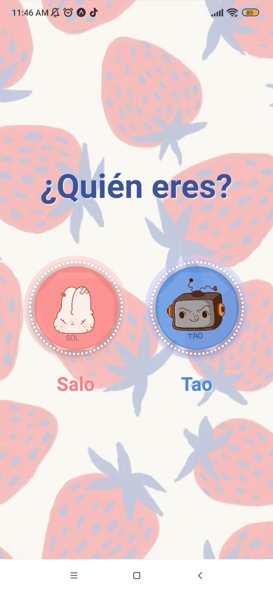
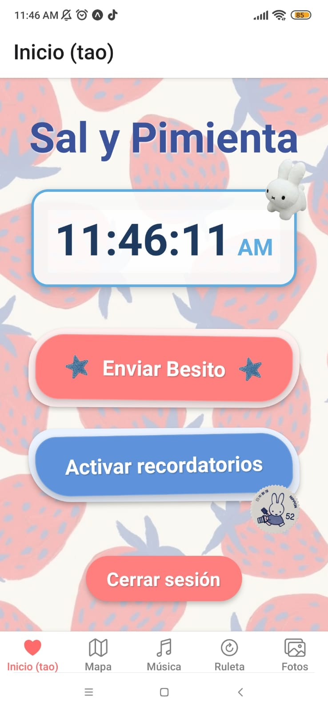
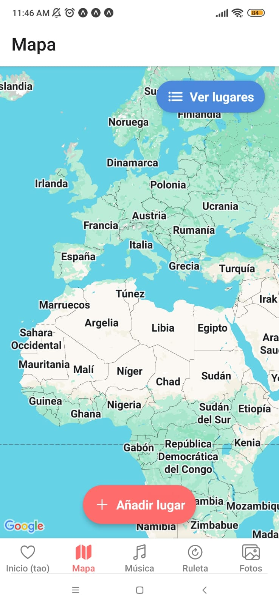
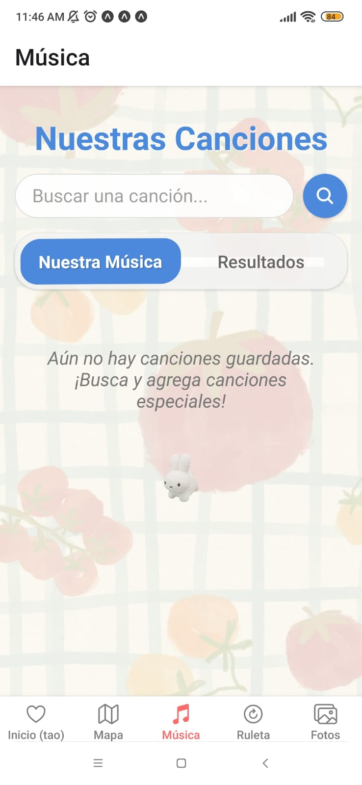
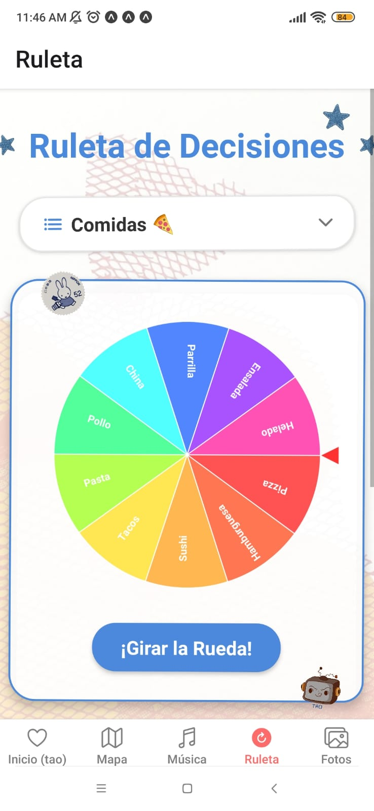
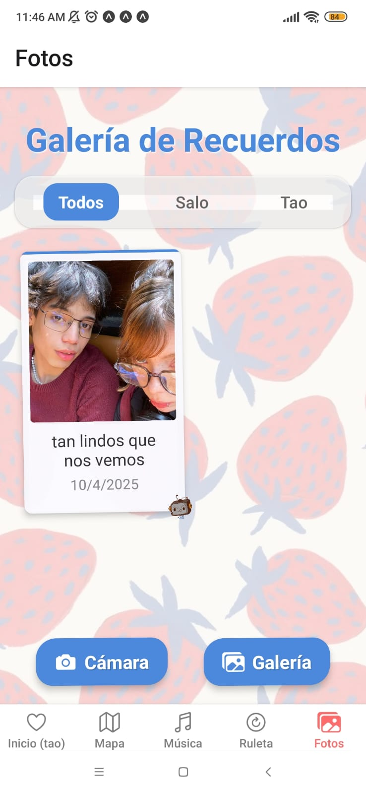

# Sal y Pimienta 

## Estado del Proyecto
Actualmente, el desarrollo de la aplicación se encuentra en pausa debido a limitaciones con la licencia de Apple Developer necesaria para el despliegue en dispositivos iOS. Retomaré el proyecto cuando pueda adquirir dicha licencia.

## Sobre la App
Esta aplicación personal fue creada como un espacio digital compartido entre mi pareja y yo. Permite:

- Enviarnos notificaciones personalizadas
- Marcar y recordar lugares que hemos visitado juntos
- Integración con la API de Spotify para guardar canciones significativas
- Una ruleta interactiva para decisiones aleatorias
- Galería de momentos compartidos con fotos de nuestros recuerdos

## Capturas de Pantalla

